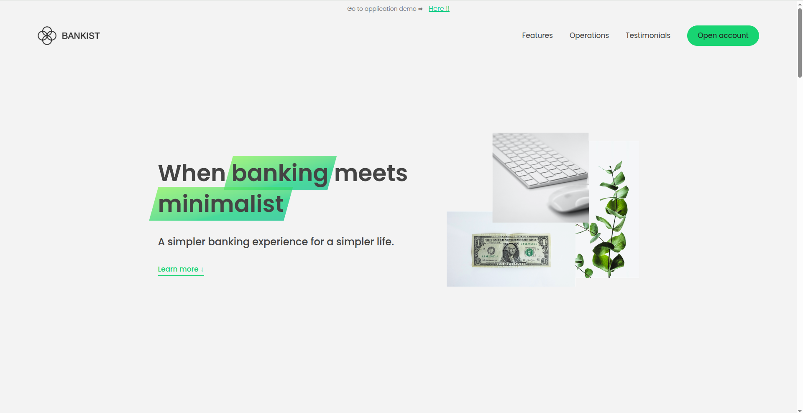
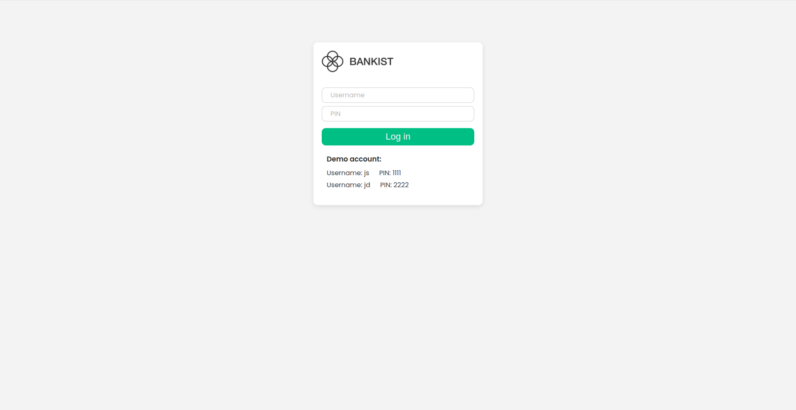
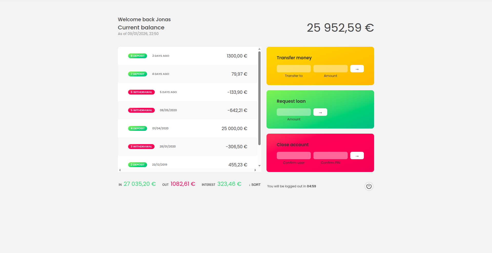

  

  
  
  
  

# Bankist

Bankist is an application that displays the results of our deposits and withdrawals, sends money to other accounts, and also makes loans to banks. In this project, the main focus is the implementation of array methods, numbers, and advanced topics on DOM manipulation. This project contains 3 sections into one application. I also made this website into a responsive design and made a few changes to the UX. This fictional project is part of the same course taken on Udemy, and the instructor is Jonas Schmedtmann.

- [The Complete JavaScript Course 2025: From Zero to Expert!](https://www.udemy.com/course/the-complete-javascript-course/?couponCode=KEEPLEARNING)

## Things i learned

- Array Method and displaying list to DOM
- Sorting array
- Dynamic Render internalization text

## Screenshot of the project

## Thanks

I hope that by completing this project I will gain good experience and knowledge that will be useful for my career.
